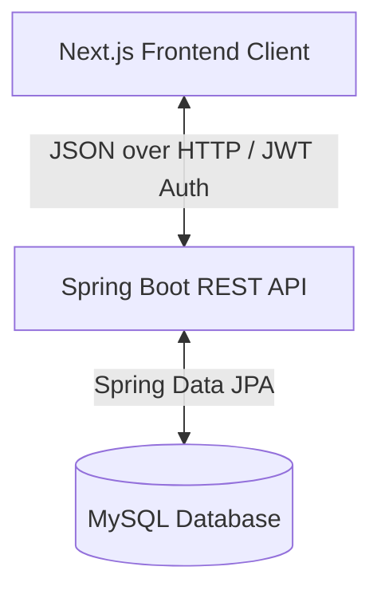
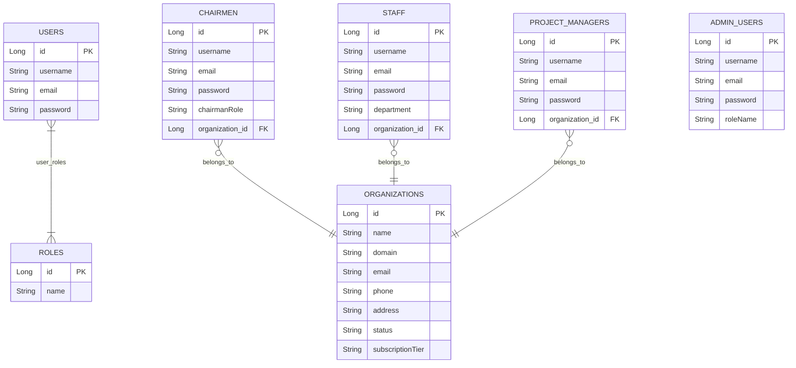
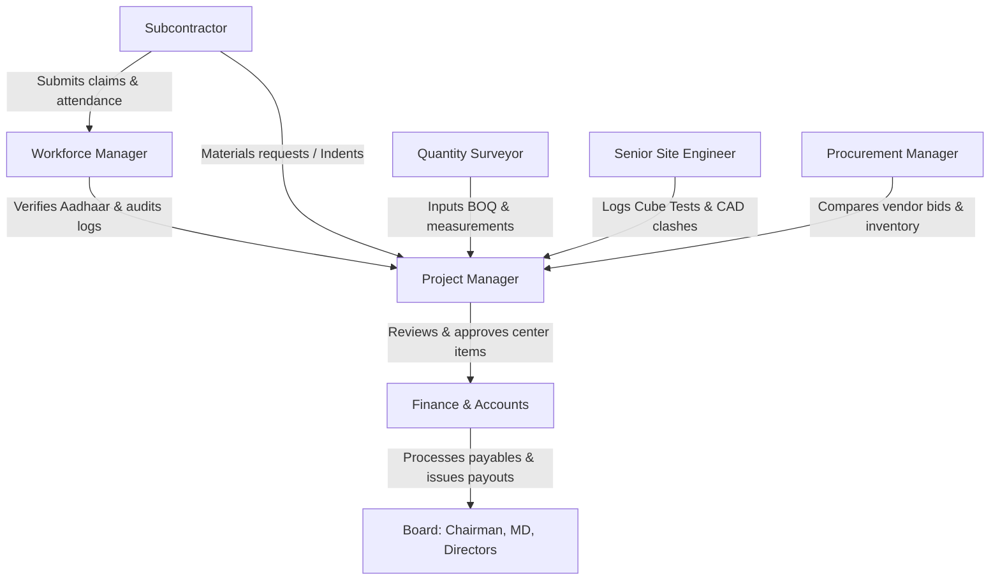
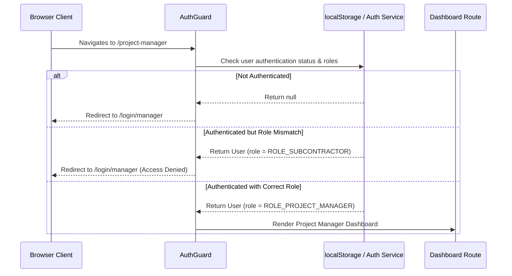
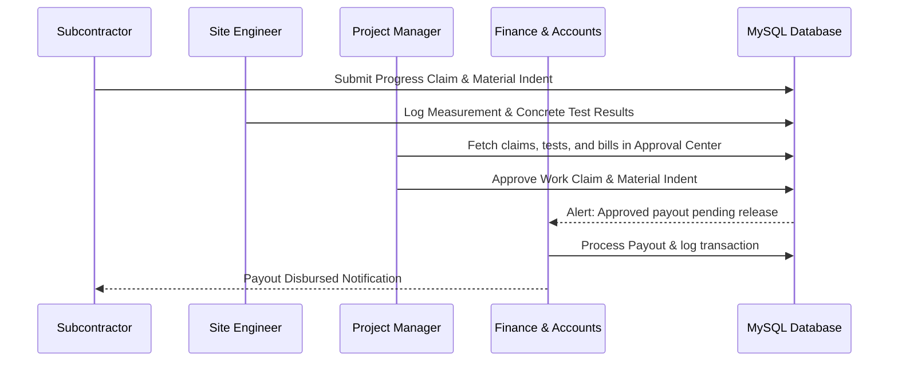

# BuildWell ERP — Construction Management & AI Operations Platform

Welcome to the **BuildWell ERP** (formerly BuildCon) comprehensive system documentation. This document outlines the system architecture, design patterns, entity-relationship diagrams (ERD), role-based workflows, API structures, frontend-backend communications, and installation steps.

---

## 1. Project Overview & Fundamentals

In the construction sector, project execution requires coordinating dozens of operational departments. The **BuildWell ERP** acts as the central digital nervous system, facilitating real-time coordination of:
- **Corporate Planning**: Financial forecasting, project health scoring, and board approvals.
- **Sales & Marketing**: Lead tracking, proposal estimates, and channel conversions.
- **Quantity Surveying (QS)**: Bill of Quantities (BOQ) limits and on-site measurements ledger tracking.
- **Logistics**: Purchase requisitions, low-stock notifications, and vendor bids selection.
- **Field Operations**: Daily supervisor diaries, safety compliance audits, Aadhaar worker verification registries, concrete cube compressive strength logs, and blueprint clash detection.

---

## 2. Architecture & Design Patterns

The platform is designed as a decoupled, multi-tier enterprise application consisting of a responsive Next.js frontend, a robust Spring Boot microservice backend, and a relational MySQL database.



### Key Design Patterns Implemented
1. **Role-Based Access Control (RBAC)**:
   - **Frontend**: Controlled via [AuthGuard.tsx](file:///c:/Users/PRAVEEN/Downloads/buildcon-erp-frontend/buildcon-erp/components/AuthGuard.tsx). It inspects roles stored in `localStorage` (mock mode) or JWT response payload, preventing unauthorized users from accessing sub-paths.
   - **Backend**: Configured via Spring Security where endpoints are annotated with `@PreAuthorize` or configured via HTTP security matchers corresponding to the roles defined in the `ERole` enum.
   - **Hidden Login Portal**: The system owner / Admin login dashboard is deliberately omitted from the landing page. It is only accessible via a direct, hidden URL path (`/login/super-admin`).
2. **MappedSuperclass Inheritance**:
   - To keep user profiles clean and avoid repeating common security attributes (username, email, password, organizationId), the backend utilizes `BaseUserEntity` annotated with `@MappedSuperclass`. Specialized tenant-level entities inherit from this.
   - **System Owner Exception**: The `AdminUser` (the application owner) does *not* inherit from `BaseUserEntity`. It is modeled independently to completely remove any organization constraints, as the Admin manages the entire platform globally.
3. **Data Transfer Object (DTO) / Payload Pattern**:
   - Decoupled requests and responses (such as `SignupRequest` and `JwtResponse`) ensure that only the required data is sent over the network, avoiding circular references and securing password fields.
4. **Service-Repository Pattern**:
   - The Spring Boot backend adheres strictly to layered architecture: Controllers handle incoming web requests -> Services/ServiceImpls manage validation and transaction controls -> Repositories interface with the MySQL database.

---

## 3. Entity-Relationship Diagram (ERD)

The database schema manages organizations, user credentials, and specialized role-based operational entities.



---

## 4. Role-Based Features & Communication Flow

BuildWell ERP supports **15 distinct roles** divided into four logical portals. Here is how information flows between portals and the relationship between roles:



### Detailed Role Matrix

| Role | Key Features & Responsibilities | Upstream Context (Input From) | Downstream Action (Data Sent To) |
| :--- | :--- | :--- | :--- |
| **Chairman / Owner** | High-value project financial approvals, corporate health scorecards, organizational controls. | MD, Finance Director | Board of Directors, Executive Team |
| **Managing Director (MD)** | Oversees operations performance across all divisions. | Project Director, BD Director | Chairman, Department Managers |
| **Project Director** | Multi-project engineering audits, timeline variance, risk heatmaps. | Project Managers | MD, Chairman |
| **Business Dev Director**| Tender bidding pipelines, conversion funnels, pre-sales estimations. | Marketing & Sales Executives | Managing Director |
| **Finance Director** | Cash flow charts, taxation, corporate treasury audits, CAPEX approvals. | Finance & Accounts | MD, Chairman |
| **Marketing Manager** | Campaigns oversight, budget metrics, lead source analysis. | Digital Marketing TL | Business Dev Director |
| **HR Manager** | Staff directories, employee attendance tracking, payroll release validations. | Workforce Manager | Finance Director |
| **Construction Manager**| High-level equipment deployment tracking, site coordination. | Project Managers | Managing Director |
| **Digital Marketing TL**| Ad campaign budget allocation, marketing team assignments. | Digital Marketing Executive | Marketing Manager |
| **Digital Marketing Exec**| Daily content calendars, social impressions, click analytics. | Lead Feedbacks | Digital Marketing TL |
| **Sales Team Leader** | Lead allocations, conversion tracking, sales goals. | Sales Executives | Business Dev Director |
| **Sales Executive** | Daily client calling logs, lead scoring, quotation generation. | Marketing Leads | Sales Team Leader |
| **Project Manager** | Gantt charts, budget variance, work claims approvals, contract releases. | QS, Site Engineers, Subcontractors | Board & Executive Portals, Finance |
| **Quantity Surveyor (QS)**| BOQ limit configurations, Measurement Book ledgers. | Site Management | Project Manager |
| **Procurement Manager** | Requisitions comparing, inventory catalogs, low-stock warnings. | Site Management | Project Manager, Finance |
| **Finance & Accounts** | Vendor bills ledger, payout releases, GST/tax filings. | Project Manager (Approved bills) | Banking Integration, Board |
| **Site Management (Site Supervisor)** | Daily site log diary, safety checklists, material indent creation. | Workforce (attendance) | QS, Project Manager |
| **Workforce Manager** | Aadhaar verification registries, labor count audit grids. | Subcontractor Partner | Project Manager, HR |
| **Subcontractor Partner**| Daily progress claims submission, material requisitions. | Site Supervisor | Workforce Manager, QS, PM |
| **Senior Site Engineer** | Compressive cube test logs, CAD clashing views, Non-Conformance Reports. | Site Management | Project Manager, Board |

---

## 5. System Workflows

### User Authentication Flow (Frontend Guarding)


### Operations Approval & Payment Cycle Flow


---

## 6. Frontend Structure & Data Flow

### Frontend Project Tree
```
buildcon-erp/
├── app/
│   ├── login/                        # Segmented login dashboards
│   │   ├── chairman/                 # Chairman Login portal
│   │   ├── director/                 # Board of Directors login page
│   │   └── manager/                  # General management portals login
│   ├── chairman/                     # Chairman UI features
│   ├── md/                           # MD UI features
│   ├── project-manager/              # Gantt and approvals dashboard
│   ├── quantity-surveyor/            # BOQ tracker
│   ├── procurement-manager/          # Inventory & RFQ templates
│   ├── finance-accounts/             # Accounts ledgers
│   ├── site-management/              # Logs & safety grids
│   ├── workforce-manager/            # Worker Aadhaar verification
│   ├── subcontractor/                # Subcontractor claims portals
│   ├── senior-site-engineer/         # Concrete logs & clash detection views
│   ├── globals.css                   # Global styling
│   └── layout.tsx                    # Shared page wrapper
├── components/
│   ├── AuthGuard.tsx                 # Client-side route protector
│   └── ui/                           # Reusable UI widgets
└── lib/
    └── auth.ts                       # Credentials configuration
```

### Data Transfer Mechanics
- **State Management**: Uses React standard hooks (`useState`, `useEffect`) for dashboard state propagation.
- **REST Communication**: In production mode, the components invoke the Java Spring Boot REST endpoints using standard `fetch` or `axios` packages. The credentials token (JWT) is attached in the request header as:
  ```http
  Authorization: Bearer <JWT_TOKEN>
  ```
- **Local Caching**: LocalStorage stores the session details to preserve active dashboard state across tab navigation.

---

## 7. API Endpoints Reference

All backend APIs are hosted by default on `http://localhost:8081`. 

### Authentication Endpoints
| HTTP Method | API Path | Request Body | Response Body | Description |
| :--- | :--- | :--- | :--- | :--- |
| **GET** | `/api/auth/roles` | *None* | `["ROLE_ADMIN", "ROLE_USER", ...]` | Lists all supported user roles in the ERP. |
| **POST** | `/api/auth/signin` | `LoginRequest` (username, password) | `JwtResponse` (jwt, id, email, organizationId, roles) | Authenticates a user and issues a JWT token. |
| **POST** | `/api/auth/signup` | `SignupRequest` (username, email, password, roles) | `MessageResponse` (message) | Registers a new generic user account. |

### Organization Management Endpoints
| HTTP Method | API Path | Request Body | Response Body | Description |
| :--- | :--- | :--- | :--- | :--- |
| **POST** | `/api/organizations` | `OrgCreationRequest` (name, domain, email, phone, address, status, subscriptionTier) | `Organization` | Registers a new enterprise corporate client. |
| **GET** | `/api/organizations` | *None* | `List<Organization>` | Returns list of all registered organizations. |
| **GET** | `/api/organizations/{id}` | *None* | `Organization` | Retrieves detail of an organization by ID. |
| **DELETE** | `/api/organizations/{id}` | *None* | `MessageResponse` | Deletes an organization by ID. |

### Role Signup Endpoints
| HTTP Method | API Path | Request Body | Response Body | Description |
| :--- | :--- | :--- | :--- | :--- |
| **POST** | `/api/admin/signup` | `GenericSignupRequest` | `MessageResponse` | Registers a Platform Admin account (unbound to any organization). |
| **POST** | `/api/chairman/signup` | `ChairmanSignupRequest` (username, email, password) | `MessageResponse` | Registers a Chairman account. |
| **POST** | `/api/md/signup` | `GenericSignupRequest` | `MessageResponse` | Registers a Managing Director account. |
| **POST** | `/api/project-director/signup`| `GenericSignupRequest` | `MessageResponse` | Registers a Project Director account. |
| **POST** | `/api/project-manager/signup` | `GenericSignupRequest` | `MessageResponse` | Registers a Project Manager account. |
| **POST** | `/api/quantity-surveyor/signup`| `GenericSignupRequest` | `MessageResponse` | Registers a Quantity Surveyor account. |
| **POST** | `/api/procurement-manager/signup`| `GenericSignupRequest`| `MessageResponse` | Registers a Procurement Manager account. |
| **POST** | `/api/finance-accounts/signup`| `GenericSignupRequest` | `MessageResponse` | Registers a Finance & Accounts officer. |
| **POST** | `/api/site-management/signup` | `GenericSignupRequest` | `MessageResponse` | Registers a Site Supervisor account. |
| **POST** | `/api/workforce-manager/signup`| `GenericSignupRequest` | `MessageResponse` | Registers a Workforce Manager account. |
| **POST** | `/api/subcontractor/signup` | `GenericSignupRequest` | `MessageResponse` | Registers a Subcontractor account. |
| **POST** | `/api/senior-site-engineer/signup`| `GenericSignupRequest`| `MessageResponse` | Registers a Senior Site Engineer account. |

---

## 8. Installation & Setup

### Prerequisites
1. **Node.js**: Version 18.x or higher.
2. **Java Development Kit (JDK)**: Version 17 or higher.
3. **Maven**: For building the backend.
4. **MySQL Database**: Version 8.x or higher running locally on port 3306.

---

### Step 1: Database Setup
1. Open your MySQL client (CLI, Workbench, or phpMyAdmin).
2. Create a new database named `buildcon_erp`:
   ```sql
   CREATE DATABASE buildcon_erp;
   ```
3. Default connection credentials are configured to:
   - **Host**: `localhost:3306`
   - **Username**: `root`
   - **Password**: `root`
   *(Modify credentials inside `/buildcon-erp-backend/src/main/resources/application.properties` if they differ on your local setup)*

---

### Step 2: Backend Installation & Run
1. Open your terminal and navigate to the backend directory:
   ```bash
   cd c:/Users/PRAVEEN/Downloads/buildcon-erp-frontend/buildcon-erp-backend
   ```
2. Build the Maven package:
   ```bash
   mvn clean install
   ```
3. Run the Spring Boot application:
   ```bash
   mvn spring-boot:run
   ```
4. The backend server should start on port `8081`. You can access API documentation or perform requests via `http://localhost:8081`.

---

### Step 3: Frontend Installation & Run
1. Open a new terminal session and navigate to the frontend directory:
   ```bash
   cd c:/Users/PRAVEEN/Downloads/buildcon-erp-frontend/buildcon-erp
   ```
2. Install the node packages:
   ```bash
   npm install
   ```
3. Run the local development server:
   ```bash
   npm run dev
   ```
4. Open your web browser and navigate to [http://localhost:3000](http://localhost:3000) to view the application dashboard.
