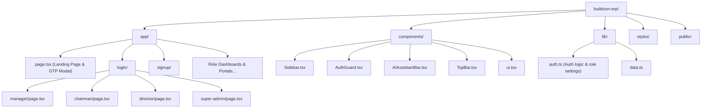

# BuildCon ERP Frontend Architecture Overview

This document presents a structured directory map, key flows, and an architectural overview of the Next.js-based BuildCon ERP frontend workspace.

---

## 📂 Project Structure Map

---

## 🔑 Core Client Flows

### 1. Verification & Selection Gate (`/`)
* **File**: [app/page.tsx](file:///c:/Users/PRAVEEN/Downloads/buildcon-erp-frontend/buildcon-erp/app/page.tsx)
* **Functionality**:
  * Unauthenticated landing page showing hero sliders, about panels, and statistics.
  * Real-time dynamic OTP lookup modal querying active organizations from backend `/api/organizations`.
  * Deterministic time-based OTP generation + validation (retains current + past 2 OTP windows).
  * Automatically stores `selected_login_org` (Name), `selected_login_tier` (Subscription Tier), and `selected_login_org_id` (Database ID) to `localStorage` on verification.

### 2. Sign-Up Portal (`/signup`)
* **File**: [app/signup/page.tsx](file:///c:/Users/PRAVEEN/Downloads/buildcon-erp-frontend/buildcon-erp/app/signup/page.tsx)
* **Functionality**:
  * Registers users for 26+ specific roles.
  * Captures the validated `organizationId` from client `localStorage` and embeds it in the POST request body.
  * Dispatches POST request dynamically to role-specific backend signup endpoints (e.g. `/api/hr-manager/signup`, `/api/project-manager/signup`).

### 3. Staff Sign-In Portal (`/login/manager`)
* **File**: [app/login/manager/page.tsx](file:///c:/Users/PRAVEEN/Downloads/buildcon-erp-frontend/buildcon-erp/app/login/manager/page.tsx)
* **Functionality**:
  * Reads the organization's tier from `localStorage`.
  * Dynamically filters the roles select dropdown options to display only those allowed for the active organization's subscription tier:
    * **Growth Tier**: Limit to construction management and field site operations.
    * **Premium Tier**: Extends support to surveyors, financial accounts, and HR.
    * **Enterprise Tier**: Complete suite access including digital marketing, business development, and TL teams.
  * Dynamically hides/shows the directors portal link at the bottom of the sign-in block based on the organization's tier.

---

## 🏛️ Reusable Component Ecosystem (`/components`)

1. **[AuthGuard.tsx](file:///c:/Users/PRAVEEN/Downloads/buildcon-erp-frontend/buildcon-erp/components/AuthGuard.tsx)**: Wraps protected pages to authenticate users and verify access privileges.
2. **[Sidebar.tsx](file:///c:/Users/PRAVEEN/Downloads/buildcon-erp-frontend/buildcon-erp/components/Sidebar.tsx)**: Adaptive vertical navigation menu highlighting appropriate menu items depending on the user's role.
3. **[AIAssistantBar.tsx](file:///c:/Users/PRAVEEN/Downloads/buildcon-erp-frontend/buildcon-erp/components/AIAssistantBar.tsx)**: Side-panel overlay connecting to generative AI tools for operations analysis.
4. **[TopBar.tsx](file:///c:/Users/PRAVEEN/Downloads/buildcon-erp-frontend/buildcon-erp/components/TopBar.tsx)**: Header component presenting search, notification indicators, active user metadata, and logout hooks.
5. **[ui.tsx](file:///c:/Users/PRAVEEN/Downloads/buildcon-erp-frontend/buildcon-erp/components/ui.tsx)**: Generic modern inputs, select boxes, buttons, cards, and modal components styled in dark-theme aesthetics.

---

## 🛠️ Utility Libraries (`/lib`)

* **[auth.ts](file:///c:/Users/PRAVEEN/Downloads/buildcon-erp-frontend/buildcon-erp/lib/auth.ts)**:
  * Exposes the login handler communicating with backend endpoints.
  * Holds configuration constants defining dashboards and home paths for each user role (`homeForRole`).
* **[data.ts](file:///c:/Users/PRAVEEN/Downloads/buildcon-erp-frontend/buildcon-erp/lib/data.ts)**:
  * Static mocked dataset fallback lists used when endpoints are unreachable.
